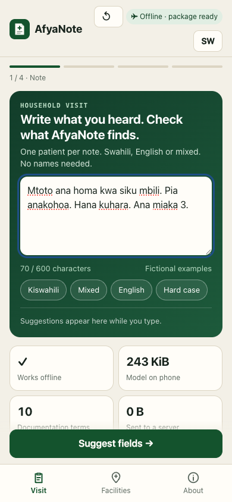
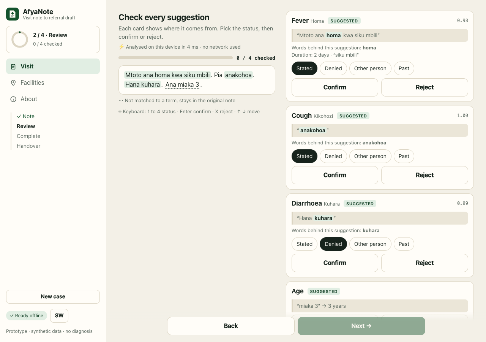
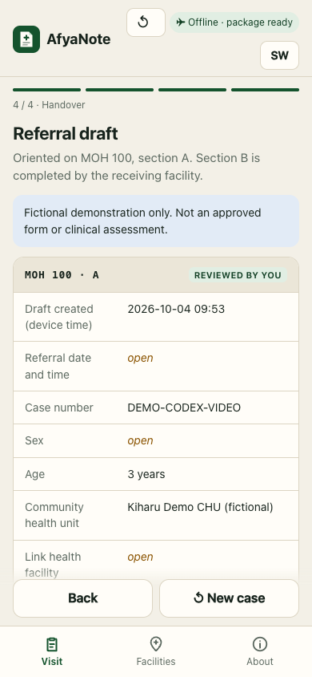

# AfyaNote

**Offline visit note to referral draft for community health promoters.**
Hack Nation 7th Global AI Hackathon · Challenge 4 World Bank "Small AI for Development" · Health track.

> Prototype. Synthetic data only. Does not diagnose, does not set urgency, not approved for clinical use. All people and notes in this repo are fictional.

## Problem statement

Because of AfyaNote, we aim to help a community health promoter in Kenya turn a short Swahili visit note into a reviewed referral draft during the household visit, while the family can still answer missing questions. Documentation burden is supported by a five-country primary-care study (Siyam et al. 2021, not Kenya). Kenya already has eCHIS; the need for this additional workflow and its integration are still to be established. On synthetic held-out phrasings, the classifier reaches F1 0.85 versus 0.50 for a phrase dictionary. Workflow benefit and physical target-phone performance remain unmeasured.

## Screenshots

Screenshots below come from the recorded **v0.4.17** desktop-browser session, using a narrow viewport for note and draft. They are not a physical-phone test. [Capture details, 75.56-second clip and eight images](docs/05_pitch/assets/codex_v0417/README.md); [other media and their status](docs/05_pitch/assets/README.md).

| Note | Desktop review with evidence | Fictional draft |
|---|---|---|
|  |  |  |

## What it does

1. **Note.** The CHP types a short note (Swahili, English or mixed). One patient per note. While she types, a live preview shows which terms the model sees. Nothing is accepted at this point.
2. **Review.** A small model running in the browser proposes documentation terms per passage and shows the exact passage it came from. Rules mark each term as *stated*, *denied*, *about another person* or *in the past*, and flag conflicts. Explicit age and duration are read only when a number and a unit are present. The CHP confirms, corrects or rejects every item. Nothing is accepted automatically. An "Ask before you leave" card lists what a receiving officer will miss (age, duration of each confirmed symptom) so the CHP can ask the family while she is still there; answers are marked as "asked during the visit" in the draft. On a desktop the review works with the keyboard (1 to 4, Enter, X).
3. **Complete.** The CHP adds what a note cannot contain (case number, sex, referral time, treatment actually given, link facility, consent).
4. **Facilities.** An offline map (no map tiles, plain SVG) shows facilities around the community health unit by straight line distance. The CHP picks the link facility; AfyaNote does not recommend one. The list in this prototype is fictional.
5. **Handover.** A draft oriented on section A of the Kenyan MOH 100 Community Referral Form. Open fields stay visibly open. Export (copy text or JSON) is only possible after every suggestion was reviewed and consent was recorded.

If a confirmed term is one of the WHO IMCI general danger signs, the app shows a neutral reminder to check the local protocol. It never says "refer today" and never shows a "safe" state.

## Why AI, and why small

Manual form entry takes work. A keyword list misses spelling variants, morphology (*anakohoa*, *alikohoa*, *kikohozi*) and mixed-language phrasing. A language model adds runtime and memory requirements and can invent text; compatibility depends on the model and device. AfyaNote uses a classifier that learned from examples, stays under 250 KB and can only choose from a fixed list of terms. Every suggestion points to the words it came from. Latest measured Node/laptop timing is in eval/results.md; physical-phone performance is still unmeasured.

| | Keyword list | AfyaNote model |
|---|---|---|
| Seen phrasings, one spelling error (F1) | 0.62 | **0.95** |
| Phrasings never seen in training (F1) | 0.50 | **0.85** |
| False alarms on unrelated sentences | 7.1 % | **0 %** |
| Hand written contrast tests (negation, other person, past, age, conflicts, bad input) | 31 / 34 | **34 / 34** |

Full report: [`eval/results.md`](eval/results.md). Model card: [`docs/model_card.md`](docs/model_card.md). Numbers come from synthetic data written by the team, so they show feasibility, not clinical performance.

A second AI author (Codex) wrote **40 additional fictional notes** without opening the training lexicon or generated data: 15 Swahili, 15 English and 10 mixed. Model parameters and thresholds were not tuned on this set. Known age and person-reference errors were subsequently repaired; the table below preserves the earlier evaluation. Reruns after repair are regression evidence. Gold annotations and wording have no native-speaker or clinical review.

| Preserved earlier second-author evaluation (n=40, 63 gold terms) | Keyword list + rules | Model + rules |
|---|---|---|
| Suggested-only term micro F1 | 0.844 | 0.933 |
| Term recall, including unclear candidates | 46/63 (73.0%) | 58/63 (92.1%) |
| Correct status among found terms | 45/46 (97.8%) | 57/58 (98.3%) |
| Exact notes: every candidate label and status matches | 23/40 | 34/40 |
| Extra suggested terms | 0 | 1 |

These note metrics differ from the passage benchmarks above. The earlier person-reference failure on “Mtoto alipata degedege mbele ya mama leo” was repaired in T31. The known-set rerun now matches status on 58/58 detected model terms and 46/46 dictionary terms; term recognition is unchanged. This is a disclosed rule repair, not an independent gain. Watery/loose stool wording and “had a fit” still expose missed terms; one loose-stool note gets an extra vomiting suggestion. The earlier decimal-age error also remains visible in the documentation. See the [preserved second-author report](eval/independent_results.md), [raw results](eval/independent_results.json), [interpretation notes](eval/independent_report_notes.md) and [current known-set regression](eval/runs/20261004_final_v0417_40/results.md). No field validation is claimed.

**Context repair tradeoff:** 52 prewritten context cases now pass, but agreement on the 400 generator notes falls from 0.999 to 0.945. Their old gold assumes that a subjectless sentence after another person concerns the patient. The new rules require a human choice instead. All affected notes and increased review work are disclosed in the [T31 review](docs/03_plan/codex_context_review.md); goldlabels and model parameters were not changed.

### Measured: a fine tuned language model on the same 40 notes

We also tried the obvious alternative. Codex fine tuned **Qwen3 0.6B** (QLoRA, 600 steps, on a MacBook Air M2 with 8 GB) on the same synthetic training phrasings and scored it with the same guard and metrics on the same 40 second-author notes.

| Same 40 notes, 63 gold terms | AfyaNote classifier (preserved first run) | Qwen3 0.6B, no training | Qwen3 0.6B, fine tuned |
|---|---|---|---|
| Size on disk | **249 KB** | 335 MB INT4 weight file | 335 MB weight file + 8.7 MB adapter |
| Terms found | **58/63** | 0/63 (no valid JSON) | 54/63 |
| Correct status among found terms | **57/58** | n/a | 40/54 |
| Absent, past or other person shown as "stated" | **0** | 0 | 3 |
| Extra terms | **1** | 0 | 13 |
| Notes fully correct (terms and status) | **34/40** | 0/40 | 18/40 |
| Time per note | 0.06 ms (Node, laptop CPU) | 739 ms (M2) | 748 ms (M2) |

The INT4 weight file alone is about 1,350 times larger and makes more of the errors that matter for a referral. For this task and this data, the small classifier is the better choice. This is one run on known synthetic notes, not a general statement about language models; The full INT4 directory, including tokenizer and configuration, contains 346,929,206 bytes; disk size is not runtime RAM. Details and every error: [`llm/reports/20261004_selection_saved_40/`](llm/reports/20261004_selection_saved_40/README.md), [training review](docs/03_plan/codex_llm_training_review.md).

## Constraints of the challenge

| Rule | How AfyaNote meets it | Evidence |
|---|---|---|
| Runs on a device the user already has | Progressive web app in the phone browser of the CHP | Kenya CHP kits include smartphones (GoK 2023) |
| Core feature works offline | Service worker caches app and model; simulated network loss, reload and new browser tab tested. Physical phone / OS restart still pending | `eval/browser_runs/20261004_final_v0417/browser_report.json`, `eval/deep_runs/20261004_final_v0417/report.json` |
| Small local package | Model: 249,284 bytes. Current static app including service worker: 449,075 bytes (≈439 KiB); individual gzip sum 128,169 bytes (≈125 KiB), not measured HTTP transfer or RAM | `eval/results.md`, `eval/asset_runs/20261004_v0417/assets.json` |
| One interaction in a local language | Swahili note input, Swahili UI toggle (UI wording not yet reviewed by a native speaker) | demo |
| Human makes the final call | Every item needs confirm or reject, unclear items stay open, export needs review and consent | app |
| Constrain generated output | Fixed term list, no generated prose and evidence for every suggestion. Incorrect terms and context still occur and require review. | app, second-author test |

**Less supported language (e.g. Kikuyu):** not supported. The model will not reliably detect that a note is in Kikuyu; it may propose a term that the CHP must reject, or propose nothing. Adding a language needs real, consented and reviewed examples, annotation and its own evaluation (see roadmap).

## Architecture

```
note ──► split into passages ──► small model (char n grams, 10 terms) ──► candidates + evidence
                         └────► rules: negation, other person, past, duration, age ─┘
                                                     │
                                       CHP confirms / corrects / rejects
                                                     │
                                   MOH 100 oriented draft (section A) ──► copy / JSON
```

* `app/classify.js` exact browser port of scikit learn `CountVectorizer(analyzer="char_wb", ngram_range=(2,4), binary=True)` plus L2 normalisation and one logistic regression per term. Explicit vocabulary, no hashing. Python and browser agree to 4.9e-7 (`node eval/parity.mjs`).
* `app/rules.js` passage splitting, assertion rules (the subject of a passage carries over within a sentence and after "pia" / "also"), duration and age extraction, conflict detection, keyword baseline.
* `app/app.js` UI (tab bar on phones, sidebar on desktop). Case data lives in memory only.
* `app/facilities.json` fictional demo facilities for the offline map.
* `app/sw.js` offline cache.

## Latest demo checks and materials

The combined **v0.4.17** app passed **39 browser checks** and **29 additional deep checks**, including 60 layout combinations (five widths, EN/SW, light/dark, three tabs). Every current app file is hashed before and after both runs. Tests cover review and consent gates, reset, export evidence, explicit context choice, scoped negation, malformed durations, UTF-16 spans, blocked storage/SW and actual simulated offline reload. Small-screen grid/search overflow and the misleading completion marker for a fractional manual duration were fixed. These are desktop-Chrome checks, not physical-phone, clinical or native-language validation.

T37 adds bounded per-term negation and keeps the 52 T31 cases passing. Of 56 new AI-written context cases, policy matches 54, the model pipeline 53 and dictionary pipeline 49. Two original AI expectations are doubtful and were retained; conditional wording instead requires a human choice. Existing 40/400 labels and model weights were not changed. [Full review](docs/03_plan/codex_continuation_review.md), [T37 cases and limits](eval/context_t37/README.md).

With the local server running, use `node eval/demo-regression.cjs` or `node eval/demo-deep.cjs`. Playwright and a supported browser are required. On macOS the runners use installed Chrome; optional `AFYANOTE_BROWSER_PATH` and `AFYANOTE_TEST_URL` select other setups. New outputs go to fresh directories under `eval/browser_runs/` and `eval/deep_runs/`; existing reports are retained. The known 40-note regression is reproducible with `node eval/independent.mjs --out eval/runs/NEXT_UNIQUE_RUN`. Existing output directories are rejected.

[39-check report](eval/browser_runs/20261004_final_v0417/browser_report.json), [deep report](eval/deep_runs/20261004_final_v0417/report.json), [current asset manifest](eval/asset_runs/20261004_v0417/assets.json), [current recording](docs/05_pitch/assets/codex_v0417/README.md), [follow-up tasks](BACKLOG.md). All development files remain in this shared project.

[Workspace and file rules](docs/00_organisation/ordner_und_dateiregeln.md), [data guide](data/README.md), [evaluation guide](eval/README.md). Original research and historical transfers are kept outside the active project; the parent folder has a searchable workspace index.

## Data

| Dataset | Source | Licence | Size | Use |
|---|---|---|---|---|
| Synthetic passages | written by the team (`training/lexicon.py`, `training/generate_data.py`) | MIT, this repo | 5,000 train, 1,000 dev, 800 typo test, 800 held out test | training, threshold choice, tests |
| Synthetic notes | same generator | MIT | 400 notes, 870 gold terms | pipeline test incl. status |
| Contrast tests | hand written in `eval/eval.mjs` | MIT | 34 | fixed expected behaviour |
| Context regression | ChatGPT/Codex, `eval/context_t31/cases.json` | MIT | 52 | known-pattern rule and pipeline checks, no native-language review |
| WHO IMCI general danger signs | WHO IMCI chart booklet | WHO terms of use | 4 terms | term list, reminder text |
| MOH 100 Community Referral Form | Kenya Ministry of Health (historical template) | public form | section A fields | draft layout |
| Demo facilities | invented by the team (`app/facilities.json`) | MIT | 9 facilities | offline map; replace with the Kenya Master Health Facility List or healthsites.io (ODbL) for real use |

**What the data does not cover**
* No real CHP notes. Every sentence is synthetic and written by people who are not native Swahili speakers.
* No review by a native speaker or a clinician yet.
* No Sheng, no regional languages (Kikuyu, Luo, Kamba …), no voice.
* Short notes about one patient. Long narratives and several patients are not handled. A subjectless sentence after another or unresolved person requires human choice; other subjectless notes still use a note-patient convention.
* Person, negation and time are separate internal dimensions, but the existing export has one status. Combined or ambiguous cases require choice and retain their original evidence; this does not provide a full structured representation of every dimension.
* Test sets come from the same generator as training (held out phrasings and spelling errors reduce, but do not remove, this bias). Status accuracy on generated notes is optimistic because the generator uses the same cue words as the rules.
* The MOH 100 template is a historical version; the current county or eCHIS version was not checked.
* Facility names and positions are fictional; distances are straight line, not road distance.

## Privacy and safety

| Question from the brief | AfyaNote prototype |
|---|---|
| Where does the data sit? | In the page memory of the open app only. No localStorage, no database, no server. App files and the model are cached. |
| Who can read it? | Whoever sees the unlocked phone while the case is open. No multi user protection is claimed. |
| App in background? | Case content is blurred while the app is hidden, and closing the tab with an open case asks first. |
| Shared phone? | "New case" clears everything. No history, no names needed, nothing in the URL. |
| Lost phone? | The app keeps no case database. Downloads, clipboard contents, PDFs, screenshots, QR scans and possible browser/OS traces remain outside its control. A pilot would need device encryption, access control and a retention policy. |
| What leaves the phone? | Nothing automatically. Export only after review, by an explicit tap. A downloaded file is then outside the app's control. |
| Hosting | Static files only. No analytics, no error tracking, no API calls. |
| Accessibility | axe 4.10 audit (WCAG 2 A/AA and best practice) on all 8 views, light and dark: 0 violations. Map pins work with Tab and Enter. |

Relevant law for a pilot: Kenya Data Protection Act 2019 and Digital Health Act 2023. No compliance claim is made for the prototype.

## Repository map

See [`00_INDEX.md`](00_INDEX.md) for what is where (app, training, evaluation, research, tasks, pitch). Working notes in `docs/` are partly in German.

## Run it

```bash
python3 -m pip install scikit-learn numpy        # only for retraining
python3 training/generate_data.py                 # synthetic data -> data/
python3 training/train.py                         # model -> app/model.json
node eval/parity.mjs                              # Python vs browser check
node eval/eval.mjs                                # report -> eval/results.md
cd app && python3 -m http.server 8000             # open http://localhost:8000
python3 eval/e2e.py http://localhost:8000/ /tmp   # optional browser test (Playwright)
```

The configured `.github/workflows/check.yml` runs on push/PR once a repository is created. No GitHub execution has been observed in this workspace. It includes: syntax check, Python vs browser parity, evaluation (fails if any contrast test fails) and a scan that the app code uses no storage for case data.

Deploy: any static host. On Vercel import the repo, framework preset "Other", output directory `app` (already set in `vercel.json`).

**Offline test on a phone:** open the live link once, wait for "Ready offline", switch on flight mode and turn off WiFi, close the browser, open the app again, run a new note.

## Roadmap

* **LLM remains outside the app.** No CHP device-fleet RAM or physical-phone measurement is available. Gemma 3 270M/1B are a defined optional first experiment pair, not a latest/best-model claim. Strict quotes and schema limit output shape, but do not establish semantic correctness. The repaired capture/scorer and source-backed decision are in [llm/README.md](llm/README.md) and [docs/03_plan/lokales_llm.md](docs/03_plan/lokales_llm.md). Original Claude SFT data are preserved with disclosed overlap. T38 rebuilt a separate family split; T39/T42 performed three actual local QLoRA runs. A fourth controlled development run is tracked in T47. Semantic errors remain; no trained LLM was added to the app.

1. Check the workflow with CHPs and a receiving clinician; confirm the current referral form and eCHIS fields.
2. Build a consented, reviewed note dataset with a partner; add negation, person and time annotations.
3. Explore embedding as a component inside the existing community health app instead of a separate app, to avoid double entry. Kenya's eCHIS runs on the Community Health Toolkit, which documents UI extensions (v5.2+) and FHIR interoperability; whether the Kenyan version supports this was not checked. Details: `docs/03_plan/pilot_und_skalierung.md`.
4. Pilot: measure total time incl. review, correction effort and completeness against the manual form.
5. Kikuyu and other languages only after their own data and evaluation.

## Sources

* Siyam A. et al. (2021). The burden of recording and reporting health data in primary health care facilities in five low and lower middle income countries. BMC Health Services Research. https://doi.org/10.1186/s12913-021-06652-5
* Government of Kenya (2023). Speech at the flagging off of community health promoters kits. https://president.go.ke/wp-content/uploads/AT-THE-FLAGGING-OFF-OF-COMMUNITY-HEALTH-PROMOTERS-KITS.pdf
* Medic (2025). 2024 Annual Report (eCHIS national coverage). https://medic.org/wp-content/uploads/2025/04/Medic_2024_Annual_Report-Final.pdf
* Community Health Toolkit, Why the CHT. https://docs.communityhealthtoolkit.org/why-the-cht/
* WHO Kenya Health Profile 2025. https://www.afro.who.int/sites/default/files/2025-03/WHO%20Kenya%20Health%20Profile%202025.pdf
* World Bank (2024). Kenya secures $215 million to bolster primary health care (data quality for decision making). https://www.worldbank.org/en/news/press-release/2024/03/14/kenya-afe-secures-215-million-to-bolster-primary-healthcare-services-and-enhance-institutional-capacity
* WHO IMCI chart booklet. https://www.who.int/publications/i/item/9789241506823
* MOH 100 Community Referral Form. https://tciurbanhealth.org/wp-content/uploads/2018/04/Community-Referral-form-MOH-100.pdf
* Kenya Digital Health Act 2023. https://kenyalaw.org/kl/fileadmin/pdfdownloads/Acts/2023/TheDigitalHealthAct_2023.pdf
* OpenAI and Penda Health (2025). AI clinical copilot study (comparison, cloud LLM in clinics). https://openai.com/index/ai-clinical-copilot-penda-health/

## Licence

Code and synthetic data: MIT. Form names and WHO terms belong to their owners.

## Review of Claude-origin plans and tooling

[Review and repairs](docs/03_plan/codex_claude_review.md), [checked claims](docs/02_research/codex_claims_20261004.md) and [updated slide images](docs/05_pitch/assets/codex_review_v0411/README.md). Claude supplied the foundation; ChatGPT/Codex corrected current claims and repaired optional LLM tooling. The deployed app remains v0.4.11.


Prepared follow-up material: [120 blind-review notes](eval/gold_review/packet_20261004_v0416/README.md), [21-check local handover mock](integrations/local_mock/README.md), [moderated test materials](docs/06_pilot/README.md), [next-session prompts](docs/03_plan/next_session_prompts.md), [mobile runtime architecture](docs/03_plan/mobile_architecture_codex.md). No human review, actual trial or live integration is claimed.
