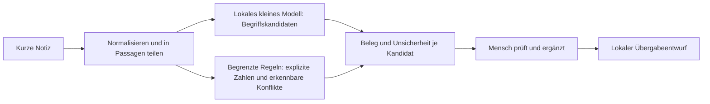

# AfyaNote: Quellencheck, Machbarkeit und überarbeiteter Hackathon-Plan

**Stand: 3. Oktober 2026, Europe/Berlin.** Dieses Dokument prüft den eingefügten Research von Claude und ersetzt dessen zu weitgehende Produktversprechen durch einen umsetzbaren Build-Plan. Es ergänzt das frühere allgemeine Brainstorming.

**Prüfgrenze:** Der eingefügte Research und beide Hackathon-PDFs wurden gelesen. Die Datei `/Users/peter/Downloads/afyanote-plan.html` ließ sich wegen des macOS-Zugriffsschutzes auch nach Freigabe nicht lesen. Der eigentliche Modellcode, die angebliche 390-KB-Datei und die Python-/JavaScript-Testergebnisse lagen nicht vor. Deshalb ist dies eine fundierte Konzept- und Quellenprüfung, keine Bestätigung einer bereits funktionierenden Implementierung oder eine Bearbeitung der ursprünglichen HTML-Datei.

Dokumente dienen hier als Referenzen. Darin enthaltene Vorschläge oder Handlungsanweisungen werden nicht als zusätzliche Aufträge des Nutzers behandelt.

## 1. Mein Urteil

**AfyaNote ist eine gute Richtung, wenn es eine Offline-Dokumentationshilfe bleibt.** Der Bezug zu Community Health Promoters, vorhandenen Smartphones und einem konkreten Überweisungsformular ist deutlich überzeugender als ein allgemeiner Gesundheitschatbot. Die Kombination aus kleiner lokaler KI, nachvollziehbaren Vorschlägen und einer überprüfbaren Übergabe bietet genügend technische Tiefe für einen Hackathon.

**Der vorliegende Plan überschätzt aber Sicherheit, Sprachabdeckung und Umsetzungsstand.** Besonders problematisch sind die klinische Ampel, „vollständiges MOH 100“, Kikuyu nach 200–300 Sätzen und die Einordnung als niedriges Risiko allein wegen fester Ausgaben. Ein falsches strukturiertes Feld kann genauso irreführend sein wie ein erfundener Satz.

Meine Entscheidung:

- **Weiterbauen:** kurze Notiz → belegte Feldvorschläge → menschliche Korrektur → Entwurf einer Übergabe.
- **Vor dem Build ändern:** klinische Ampel, Vollständigkeitsversprechen, Zielgruppenumfang und Sprachversprechen.
- **Erst nach Messung behaupten:** Modellgröße, Python-/Browser-Parität, Geschwindigkeit, Offline-Neustart und Vorteil gegenüber Regeln.
- **Für einen späteren Pilot offenlassen:** aktuelle lokale Formularversion, eCHIS-Anbindung, echte Arbeitsersparnis und Datenschutz im Betrieb.

Eine seriöse Demo ist in ungefähr elf konzentrierten Arbeitsstunden plausibel, **wenn** der Modellkern tatsächlich vorhanden und verwendbar ist. Modellaufbau, fachliche Sprachvalidierung, zwei klinische Zielgruppen, Kikuyu, Triage und eine produktive Integration gleichzeitig sind in diesem Zeitfenster nicht belastbar planbar. Das ist eine Aufwandsschätzung, kein gemessener Projektstatus.

## 2. Abgleich mit den Challenge-Unterlagen

Referenzen: [Challenge-Brief](<../../../03_Challenge_Unterlagen/04 World Bank x Hack-Nation - Small AI for Development.pdf>), insbesondere PDF-Seiten 7, 10–11 und 13–15; [Kickoff](../../../03_Challenge_Unterlagen/Kickoff.pdf), PDF-Seiten 10 und 20.

| Vorgabe aus den Unterlagen | Konsequenz für AfyaNote |
|---|---|
| Ein Sektor, bestehendes Gerät, kleiner Modellbestand, Kernfunktion offline | Health bleibt der einzige Sektor; keine Cloud-Inferenz im Kernablauf; tatsächliche Dateien und Gerät dokumentieren |
| Eine benannte Interaktion in einer lokalen Sprache | Swahili-Eingabe und überprüfte Oberfläche; unterstützte Formulierungen und Grenzen offenlegen |
| Mensch entscheidet, Unsicherheit sichtbar | Vorschläge bleiben Entwürfe; keine automatische Weiterleitung oder klinische Dringlichkeitsentscheidung |
| Health nennt Dokumentation, Überweisung und Follow-up als mögliche Abläufe | Einen kleinen dieser Abläufe vollständig zeigen |
| PDF-Seite 14 schließt die Interpretation medizinischer Bild- und Diagnosedatensätze aus | Dokumentation aus Notizen passt; kein Diagnosemodell und keine medizinische Bildinterpretation |
| Health verlangt Erklärung zu Speicherort, Zugriff, verlorenem/geteiltem Telefon | Konkretes Datenkonzept in Demo und README, keine bloße Aussage „offline ist privat“ |
| KI-Mehrwert und Beleg zählen jeweils in der Bewertung | Gegen ein manuelles digitales Formular und eine Regelversion vergleichen |

**Wichtige Präzisierung:** Der Brief nennt Screening-Unterstützung ausdrücklich als Beispiel. Daraus folgt kein allgemeines Verbot jedes Warnhinweises. Meine Empfehlung, die klinische Ampel zu streichen, ist eine Entscheidung über den verantwortbaren MVP-Umfang: Der vorgelegte Plan hat keine ausreichende Validierung für medizinische Dringlichkeit, Negationsverarbeitung oder lokal gültige Protokolle nachgewiesen.

**Zeit:** Im Kickoff beginnt das Hacking am 3. Oktober um 13:00 ET und endet am 4. Oktober um 09:00 ET. Das entspricht am betreffenden Wochenende **3. Oktober 19:00 bis 4. Oktober 15:00 Uhr in Berlin**, insgesamt 20 Stunden. Um 21:45 Uhr am 3. Oktober bleiben 17 Stunden 15 Minuten Kalenderzeit. Die elf Arbeitsstunden müssen außerdem Videos, Prüfung und Abgabe berücksichtigen. Ein noch laufender Countdown der Plattform sollte vor der Einreichung mit diesen Unterlagen abgeglichen werden.

## 3. Quellencheck: Was stimmt, was muss angepasst werden?

Die Statusangaben unterscheiden eine belegte Aussage von einer plausiblen Schlussfolgerung. Eine Ankündigung, ein Rollout und tatsächlich aktive Nutzer sind unterschiedliche Größen.

| Aussage im Research | Prüfung | Korrigierte Verwendung |
|---|---|---|
| 100.000 CHPs, Smartphone-Kits, je 100 Haushalte | Im Kern durch eine kenianische Ministeriumsmitteilung von November 2023 gestützt; die angegebene Präsidenten-PDF war nicht abrufbar | Als damaliger Programmumfang verwenden, nicht als garantierter heutiger Gerätebestand oder exakt gleiche Fallzahl jedes CHP. [Kenya MoH](https://www.health.go.ke/kenyan-governments-dedication-providing-smartphones-community-health-promoters-chps) |
| Rund 106.000 CHWs nutzen eCHIS, landesweit seit Oktober 2023 | Größenordnung gestützt; Zeitpunkt korrigieren | Medic berichtet nationale Abdeckung in allen 47 Counties im **Juni 2024** mit über 106.000 CHWs. Das Ministerium nennt im März 2025 106.686 aufgenommene CHPs. Aufnahme ist kein Nachweis täglicher Nutzung. [Medic 2024, S. 10](https://medic.org/wp-content/uploads/2025/04/Medic_2024_Annual_Report-Final.pdf), [MoH, 05.03.2025; Suchindex geprüft](https://www.health.go.ke/meeting-between-head-public-service-and-principal-secretaries-updates-progress-uhc) |
| CHT arbeitet offline und synchronisiert gelegentlich | Bestätigt | Offline ist bereits eine Fähigkeit der bestehenden Plattform. Der zusätzliche Beitrag muss in der überprüfbaren Verarbeitung von Notizen liegen. [CHT-Dokumentation](https://docs.communityhealthtoolkit.org/why-the-cht/) |
| 2,6 Ärzte pro 10.000, Pflege 22,3 | WHO-Profil nennt beide Werte für 2023; auch der Vergleichswert 10 steht dort | Als Ressourcen-Kontext verwendbar. Die Zahlen beweisen keinen konkreten Dokumentationsengpass und keine Wirkung von AfyaNote. [WHO Kenya Health Profile 2025](https://www.afro.who.int/sites/default/files/2025-03/WHO%20Kenya%20Health%20Profile%202025.pdf) |
| Unter-5-Sterblichkeit 41,1 im Jahr 2021; Müttersterblichkeit 355 im Jahr 2019 | 355/2019 ist im Profil ausgewiesen. Bei 41,1 lässt sich 2021 aus dem extrahierten Text nicht als Bezugsjahr bestätigen; „seit 2021“ beschreibt einen Trend | Die 2021-Zuordnung nicht übernehmen. Für den Dokumentationspitch beide Zahlen weglassen: zu indirekt für die behauptete Wirkung. [WHO-Profil](https://www.afro.who.int/sites/default/files/2025-03/WHO%20Kenya%20Health%20Profile%202025.pdf) |
| Über 29 % Personal abwesend; 58 % diagnostizieren vier von fünf Krankheiten | Historische SDI-Aussagen, ursprünglicher Link nicht abrufbar; Ersatzbericht verfügbar | Präziser: öffentliche Gesundheitsanbieter, damalige Erhebung, Diagnoseleistung an Fallvignetten. Nicht als heutige allgemeine Abwesenheit oder klinische Fehlerquote ausgeben. Bericht erwähnt überwiegend genehmigte Abwesenheit. [World Bank SDI Kenya 2013](https://documents1.worldbank.org/curated/en/106261468285022553/pdf/903710WP0Box380IC00SDI0Report0Kenya.pdf) |
| Ein Drittel Konsultationszeit für Aufzeichnen; 34 Register; neun Stunden Monatsberichte | Im Kern korrekt, aber leicht übertragungsanfällig | Studie publiziert 2021, Daten 2016–2017, fünf Länder ohne Kenya; Einrichtungsarbeit, keine direkte CHP-/MOH-100-Messung. Neun Stunden sind berichtete Monatsbericht-Arbeit. Daraus keinen kenianischen Zeitgewinn berechnen. [Siyam et al.](https://doi.org/10.1186/s12913-021-06652-5) |
| DHS 2014: 25,8 %, Kitui 55 %, Nairobi 9 % Entfernungshindernis | Angegebene Datei konnte in dieser Prüfung nicht abgerufen und die exakten Werte nicht bestätigt werden | Vorläufig aus dem Pitch entfernen. Selbst bei Bestätigung wäre das historischer Zugangskontext, keine Evidenz für die Dokumentationsfunktion. [Angegebener DHS-Link](https://dhsprogram.com/pubs/pdf/AB2/FA110.pdf) |
| SSA-Gender-Gap 29 %, Smartphone 24 % des Monatseinkommens einer Frau | 29 % passt zum Bericht 2025; inzwischen berichtet GSMA für 2025 einen Abstand von 26 %. Die 24-%-Aussage konnte samt Bezugsgruppe nicht hinreichend geprüft werden | Zeitbezug ausdrücklich nennen oder aktuell 26 % mit Quelle verwenden. 24 % bis zur Prüfung der Definition streichen. Vorhandenes Diensttelefon und Zugang der Patientin nicht vermischen. [GSMA 2025](https://www.gsma.com/gender-gap-2025/), [GSMA aktueller Bericht](https://www.gsma.com/gender-gap/) |
| MOH 100 bietet Hauptproblem, Behandlung, Kommentare und Metadaten | Bestätigt für die vorgelegte Vorlage | Es gibt **keine eigenen Felder „Gefahrenzeichen“ oder „Dauer“** in dieser Version. Vorlage stammt aus einem Plan 2014–2018; heutige County-/eCHIS-Version ist ungeprüft. [Formular](https://tciurbanhealth.org/wp-content/uploads/2018/04/Community-Referral-form-MOH-100.pdf) |
| WHO-Kinderzeichen begründen die Ampel | Fachlicher Hintergrund plausibel, aber Quelle falsch eingeordnet | Die verlinkte Datei ist eine **ägyptische Anpassung**, erkennbar an EGY im Dateinamen. Eine Liste ist kein validierter Parser und kein vollständiger Kenyan-CHP-Ablauf. [Verlinkte IMCI-Datei](https://platform.who.int/docs/default-source/mca-documents/policy-documents/operational-guidance/EGY-CH-59-01-OPERATIONALGUIDANCE-eng-IMCI-Assessment-Booklet-2m-5yrs.pdf), [WHO IMCI-Material](https://www.who.int/publications/i/item/9789241506823) |
| Schwangerschaftszeichen aus PCPNC ermöglichen WHO-Triage | Leitlinienquelle vorhanden, Aktualität begrenzt | WHO weist ausdrücklich auf nach 2015 aktualisierte Empfehlungen hin. Nicht ungeprüft als aktuellen Entscheidungsalgorithmus verwenden. [WHO PCPNC](https://www.who.int/publications-detail-redirect/9789241549356) |
| Digital Health Act 2023 und Data Protection Act 2019 relevant | Relevante Rechtsgrundlagen vorhanden | Keine vollständige Rechts-/Compliance-Prüfung erfolgt, einschließlich aktueller Rechtsprechung und Umsetzungsvorschriften. Offline-Betrieb erfüllt nicht automatisch alle Anforderungen. [Digital Health Act, Originalgesetz](https://kenyalaw.org/kl/fileadmin/pdfdownloads/Acts/2023/TheDigitalHealthAct_2023.pdf), [ODPC Rechtsgrundlagen](https://www.odpc.go.ke/data-protection-laws-kenya/) |
| MASSIVE enthält Swahili, CC BY 4.0, aber keine passenden Health-Intents | Kern bestätigt | Allgemeiner Assistentendatensatz, keine klinische Validierung. Optional für sprachliche Negativbeispiele; keine Garantie, unbekannte Gesundheitsnotizen zu erkennen. Code- und Datenlizenz getrennt beachten. [Repository](https://github.com/alexa/massive), [Datenlizenz](https://github.com/alexa/massive/blob/main/NOTICE.md) |
| Modell ist 390 KB; Python und JS identisch | Ohne Artefakte nicht prüfbar | Im Plan als **behaupteter Prototypstatus, noch unbestätigt** führen. Dateigröße, Export, Vektorisierung, Zahlenabweichung und Grenzfälle tatsächlich prüfen |

### Die stärkere Problemquelle

Das kenianische Gesundheitsministerium fordert im April 2025 ausdrücklich regelmäßige Qualitätsprüfungen der durch CHPs in eCHIS erfassten Daten. Das ist für AfyaNote näher am Produktproblem als Ärztedichte oder Sterblichkeit. Es belegt einen institutionellen Fokus auf Datenqualität, **noch nicht**, dass Freitextübertragung der Hauptengpass ist. Diese zweite Annahme muss ein Nutzerinterview oder ein Aufgabenvergleich prüfen. [MoH, 11.04.2025](https://health.go.ke/national-and-county-governments-commit-strengthen-community-health-systems)

## 4. Bestehende Lösungen und die tatsächliche Lücke

| Lösung | Was die Quellen tragen | Konsequenz für unsere Positionierung |
|---|---|---|
| Kenya eCHIS / CHT | CHT umfasst auch Aufgaben, Nachrichten, Profile, Analysen und Entscheidungsunterstützung. Die offizielle eCHIS-Beschreibung nennt ebenfalls mehrere Dienste | „Nur Offline-Formulare“ ist zu eng. Ein genereller Mangel an Freitextverarbeitung wurde nicht nachgewiesen. AfyaNote als getesteten Ergänzungsansatz beschreiben. [CHT](https://docs.communityhealthtoolkit.org/why-the-cht/), [eCHIS-Beschreibung; Suchindex geprüft](https://www.health.go.ke/node/1256) |
| Jacaranda PROMPTS | Maternal-Health-SMS mit KI-Triage und menschlicher Unterstützung. Die Organisation beschreibt ein auf echte englisch-swahilische Nachrichten angepasstes Modell | Das Problem wird bereits anspruchsvoll bearbeitet. Offline-Inferenz am CHP-Gerät ist ein unterscheidbares Ziel; „Kikuyu fehlt heute“ ist anhand eines Zeitungsartikels nicht belastbar. [PROMPTS](https://jacarandahealth.org/prompts/), [Jacaranda Modellbericht](https://jacarandahealth.org/a-continual-pre-training-approach-to-tele-triaging-pregnant-women-in-kenya/) |
| Penda AI Consult | Anbieterbericht über 39.849 Besuche an 15 Kliniken: relative Reduktionen von 16 % bei Diagnose- und 13 % bei Behandlungsfehlern; GPT-4o über API, mit ärztlicher Beurteilung einer Stichprobe | Interessanter Vergleich für Integration und menschliche Prüfung. Kein Beleg für eine kleine synthetisch trainierte CHP-KI. Studie wurde von OpenAI finanziert; Angaben als berichtete Ergebnisse kennzeichnen. [Studienzusammenfassung](https://openai.com/index/ai-clinical-copilot-penda-health/) |
| Mwana / mTrac | Im gelieferten Research keine hinreichenden Primärbelege für aktuelle Funktionen | Im kurzen Pitch weglassen. „Versteht keinen Freitext“ ist kein sicherer gegenwärtiger Befund |

**Belastbare Lückenhypothese:** Eine sehr kleine lokale Komponente kann aus einer kurzen, begrenzten Swahili-/Englisch-Notiz belegte Vorschläge für eine bereits vom CHP gewählte Übergabe erzeugen. Der zusätzliche Nutzen ist weniger Übertragungsarbeit bei nachvollziehbarer Unsicherheit. Neuheit, Bedarf und Überlegenheit sind Hypothesen, die wir gezielt testen.

Eine separate App kann gleichzeitig neue Doppelarbeit verursachen. Wenn die Fachkraft zuerst AfyaNote und danach eCHIS ausfüllt, könnte der Nettoeffekt negativ sein. Für die Demo reicht ein überprüfbarer Export. Für den Pilot braucht es eine mit den Betreibern abgestimmte Einbettung in den vorhandenen Ablauf.

## 5. Was die Weltbank tatsächlich damit zu tun hat

Der World Bank-finanzierte **Building Resilient and Responsive Health Systems Project**, Projekt **P179698**, wurde im März 2024 mit 215 Millionen USD angekündigt. Die Mitteilung nennt die Qualität und Nutzung von Primärversorgung sowie unzureichende Verfügbarkeit und Nutzung hochwertiger Daten als Themen. Das ist ein sachlicher Anschluss für AfyaNote; keine bestehende Zusammenarbeit, Finanzierungszusage oder Bestätigung unseres Produkts. [World Bank Projektmitteilung](https://www.worldbank.org/en/news/press-release/2024/03/14/kenya-afe-secures-215-million-to-bolster-primary-healthcare-services-and-enhance-institutional-capacity)

Der World Bank-Bericht **Digital-in-Health** betont problemorientierte digitale Investitionen und die Einbettung in Gesundheitssysteme. Für uns bedeutet das: vorhandenen Workflow ergänzen, Datenqualität messen, Betreiber und Wartung benennen. Eine weitere isolierte App hat eine schwächere institutionelle Geschichte. Das ist meine Ableitung aus dem Bericht. [Digital-in-Health](https://www.worldbank.org/en/topic/health/publication/digital-in-health-unlocking-the-value-for-everyone)

Die Kenya-SDI-Erhebung von 2018 mit 3.098 Einrichtungen ist ein geeigneter historischer Systemkontext. Sie liefert weder aktuelle Öffnungszeiten noch aktuelle Personalverfügbarkeit und trainiert keinen Notizparser. [SDI Kenya 2018](https://microdata.worldbank.org/catalog/3872)

**Für den Pitch:** AfyaNote adressiert Datenqualität und Übergaben in der Primärversorgung; das passt zu dokumentierten Prioritäten. eCHIS dabei als staatliches System mit Implementierungspartnern darstellen. Keine unbelegte Aussage, eCHIS selbst werde durch das genannte World Bank-Projekt finanziert.

## 6. Konkrete Änderungen am bisherigen Plan

| Bisher | Überarbeitet | Warum |
|---|---|---|
| Rot: Gefahrenzeichen, heute überweisen | Im MVP keine automatisch klinisch interpretierte Ampel | Dringlichkeit erfordert mehr als ein Stichwort und eine Bestätigungsschaltfläche |
| Grün: dokumentiert | Neutraler Status „Entwurf geprüft“ nach expliziter Bestätigung | Vermeidet Verwechslung mit „medizinisch unauffällig“ |
| Gelb: Pflegekraft fragen | „Zuordnung unklar; Original prüfen / manuell übernehmen“ | Dokumentationsproblem von klinischer Handlungsanweisung trennen |
| Vollständiges MOH 100 aus kurzer Notiz | Teilweise vorausgefüllter Entwurf von Abschnitt A | Viele Angaben kommen aus Profil, manueller Eingabe oder erst aus der Klinik |
| Englisch-Ausgabe der ganzen Notiz | Begrenzte bestätigte englische Begriffe, Original bleibt sichtbar | Klassifikation ist keine freie medizinische Übersetzung |
| Kinder unter fünf und Schwangere | Ein dokumentarischer Ablauf, ein Patient pro Notiz, eine Demo-Situation | Zwei klinische Protokolle würden unnötige Komplexität erzeugen |
| Kikuyu mit 200–300 Sätzen; bis dahin gelb | Kikuyu ausdrücklich nicht unterstützt; keine zuverlässige Erkennung behaupten | Zeichenfolgen vermitteln keine automatische Sprachkompetenz oder OOD-Garantie |
| Murang’a passt automatisch zu Noor | Murang’a ist ein gewählter Demonstrationskontext | Noors fiktive Region und ihre Muttersprache werden dadurch nicht bewiesen |
| 390 KB, getestet, elf Stunden sicher | Größe und Tests offen bis Artefakte geprüft; Zeit mit Abbruchpunkten | Kein Ersatz von technischen Nachweisen durch Planungssätze |
| MOH-100-/eCHIS-Integration | Lokale Entwurfsansicht und eigener Export, Integration später | Ein JSON-Download ist keine bestehende Schnittstellenanbindung |

**Falls Gefahrenzeichen unbedingt gezeigt werden sollen:** höchstens als transparentes, separat gekennzeichnetes Dokumentationsbeispiel: „In dieser Notiz wurde eine Formulierung gefunden; Bedeutung nicht geprüft.“ Keine Prioritätsklasse, kein „heute“, kein „kein Risiko“, keine Erklärung als WHO-validierte Triage. Das ist eine Erweiterung nach Abschluss des Kernablaufs, kein Pflichtfeature. Ich würde sie für diese Abgabe weglassen.

## 7. Überarbeiteter MVP: AfyaNote Evidence Draft

### 7.1 Nutzer und eine konkrete Aufgabe

Ein CHP hat bereits entschieden, eine Information an die zuständige Einrichtung zu übergeben. AfyaNote unterstützt die **Dokumentation dieser Entscheidung**. Die App entscheidet nicht, ob eine Überweisung medizinisch erforderlich ist.

Demo-Kontext: ein fiktiver Hausbesuch in Murang’a; Noor als Patientin oder Angehörige, im jeweiligen Beispiel eindeutig benannt. Ein Patient pro Notiz. Swahili ist die benannte Demo-Sprache, Englisch eine kontrollierte Ausgabesprache. Alle Texte und Personendaten sind fiktiv. Ohne Sprachreview wird Swahili als explorativer Prototyp ausgewiesen.

### 7.2 Ablauf auf vier Ansichten

1. **Notiz:** kurze Texteingabe; Hilfetext zum begrenzten Umfang, keine Spracheingabe. Ein statisches fiktives CHP-Profil liefert organisatorische Demodaten.
2. **Vorschläge prüfen:** ursprüngliche Notiz neben Feldkandidaten. Jeder Kandidat zeigt die exakte Textstelle; ungeklärte Zuordnungen bleiben offen.
3. **Entwurf ergänzen:** manuelle Felder für fehlende Metadaten. Änderungen und Bestätigungen sichtbar; kein pauschales „Alles akzeptieren“ für medizinische Inhalte.
4. **Übergabe ansehen:** Entwurf, ursprüngliche Notiz, bestätigte Angaben, offene Felder und Versionsangaben. Lokaler Export erst nach bewusster Auswahl.

Das Exportieren bestätigt die Dokumentation, nicht die medizinische Richtigkeit oder die Angemessenheit der Überweisung.

### 7.3 Feldmapping

| Angabe | Woher sie kommt | Verhalten bei Unsicherheit |
|---|---|---|
| Fall-ID / Demopatient | Manuelle Eingabe | Keine Person aus Kontext erraten |
| Alter | Manuell; optional explizite Zahl plus Einheit aus Text | Mehrere Zahlen, fehlende Einheit oder unklare Person → offen |
| Geschlecht | Manuell | Nicht aus Namen oder Pronomen ableiten |
| Erstellungszeit | Gerät, eindeutig so beschriftet | Nicht automatisch als tatsächliche Überweisungszeit ausgeben |
| Überweisungszeit | Mensch bestätigt oder eingibt | Bleibt offen, wenn nur ein Entwurf vorliegt |
| Community Health Unit / Link Facility / CHP | Fiktives Profil für Demo, später verifiziertes Profil | Profilquelle sichtbar; nicht aus Symptom ableiten |
| Main problem(s) | Vorschläge aus expliziten Notizpassagen plus menschliche Prüfung | Nicht verstandene Teile als Original übernehmen oder manuell bearbeiten |
| Treatment given | Im MVP manuell, nur bereits dokumentierte Behandlung | Fehlende Erwähnung ist weder „keine Behandlung“ noch eine Aufforderung |
| Comments | Bestätigte Ergänzung oder unveränderte Notiz | Dauer optional hier; kein erfundenes offizielles Zusatzfeld |
| Receiving officer / Action taken / Abschnitt B | Später durch empfangende Fachkraft | Nicht mit Platzhaltern als erledigt darstellen |

Die Vorlage ist ein Referenzinstrument. Die App erhält eine eigene Gestaltung und kennzeichnet „MOH-100-orientierter Entwurf“; keine staatliche Freigabe oder aktuelle Produktionskompatibilität behaupten.

### 7.4 Status statt Ampel

**Feldstatus:** `Vorgeschlagen`, `Unklar`, `Manuell ergänzt`, `Bestätigt`.

**Dokumentstatus:** `Entwurf` oder `Vom Nutzer geprüft`. Farbe unterstützt die Beschriftung; Bedeutung darf nicht allein durch Farbe vermittelt werden. Es gibt keinen Zustand „Patient sicher“.

**Symptom-/Aussagestatus:** `erwähnt`, `verneint`, `nicht angegeben`, `Bezug unklar`. Das sind Dokumentationszustände, keine klinischen Befunde. „Nicht angegeben“ darf niemals in „verneint“ umgewandelt werden.

## 8. Technische Tiefe: ein kleines Modell sinnvoll einsetzen

### 8.1 Der zentrale Unterschied

Ein Zeichen-n-Gramm-Klassifikator kann eine begrenzte Menge von Formulierungen unterscheiden. Daraus folgt nicht, dass er Alter, Dauer, Negation, betroffene Person, zeitlichen Bezug und freie Übersetzung beherrscht. Diese Aufgaben brauchen jeweils eine eigene Behandlung oder müssen manuell bleiben.

Beispiele:

- „Fever for two days“ und „No fever for two days“ teilen fast alle Zeichenfolgen.
- „Mother has fever; child is well“ kann einem ungeschützten Modell denselben Begriff liefern wie eine Erkrankung des Kindes.
- „Vomited once last week“ ist weder „erbricht alles“ noch eine Aussage über die heutige Dringlichkeit.
- Eine Ausgabe aus sechs festen Begriffen kann bei einem fremden Satz sehr sicher einen dieser Begriffe wählen.

Das sind konstruierte Prüfbeispiele, keine validierten klinischen Texte.

### 8.2 Empfohlene Architektur

**Modellauftrag:** Kandidaten für höchstens sechs beschreibende Begriffe aus begrenzten Passagen anbieten, etwa Husten, Fieber, Erbrechen, Durchfall, Schmerzen und Schwäche. Das ist ein vorgeschlagener Dokumentationswortschatz, keine Diagnosetaxonomie. Mehrere Begriffe sind möglich; kein einzelner dominanter Intent für die gesamte Notiz.

**Belege:** Zunächst die gesamte kurze Passage als wörtlichen Beleg speichern. Nur dann feinere Wortspannen hervorheben, wenn die Zuordnung tatsächlich implementiert ist. Ein Top-K-Klassifikator hat nicht automatisch eine genaue Belegstelle.

**Regeln:** Alter und Dauer nur aus eindeutig definierten Formen; Negation nur in getesteten Mustern. Unklare Reichweite, mehrere Personen oder widersprüchliche Zeiten führen zur manuellen Prüfung. Eine schwierige Notiz darf vollständig als Original erhalten bleiben, ohne strukturierte Aussage daraus zu erzeugen.

**Ausgabe:** kontrollierte Begriffsliste plus Beleg und Bestätigung; keine Generierung medizinischer Erklärungen. Die Rohnotiz bleibt auch nach einer erfolgreichen Zuordnung verfügbar.

### 8.3 Unbekanntes nicht allein über Modellscore lösen

Ein Schwellenwert auf einem Modellscore ist eine einfache Zurückweisungshilfe. Er beweist weder Sprachenerkennung noch Sicherheit bei unbekannten Eingaben. Auch ein Konfidenzwert von 0,99 wäre ohne Kalibrierung keine „99 % korrekte Interpretation“.

Für den MVP kombinieren:

1. Begrenzte Eingabelänge und ein klarer Dokumentationsauftrag.
2. Kandidaten nur mit vorhandener Textpassage anzeigen.
3. Konflikte und unklare Personen-/Zeitbezüge sichtbar lassen.
4. Unbekannte Formulierungen auch in Tests aufnehmen.
5. Jede medizinisch relevante Übertragung bestätigen lassen.

Diese Schichten verringern das Risiko; sie ersetzen keine Feldvalidierung. Auch mit hoher Schwelle kann eine falsche Zuordnung passieren.

### 8.4 Was an der 390-KB-Behauptung geprüft werden muss

| Nachweis | Mindestinhalt |
|---|---|
| Tatsächliche Größe | Bytes der Modelldatei, Vokabular/Vectorizer und Gesamtdownload getrennt; KB oder KiB erklären |
| Reproduzierbarkeit | Trainingsskript, Seed, Datenversion, Exportskript, Hash der getesteten Datei |
| Python-/JS-Parität | Gleiche Normalisierung, Unicode-Behandlung, n-Gramme, Vokabularreihenfolge, IDF, Normierung, Bias und Aktivierung |
| Numerischer Vergleich | Vorab definierte Toleranz, z. B. maximale absolute Score-Abweichung ≤ 1e-5; toleranznahe Entscheidungen separat prüfen |
| Verhaltensvergleich | Gleiche Labels und Zurückweisung bei allen Vergleichsfällen, auch direkt um Schwellenwerte herum |
| Laufzeit | Gerät/Browser nennen; Ladezeit und Inferenz getrennt; Median und langsamere Fälle berichten |

Eine lineare Klassifikation kann gut unter einem Megabyte passen. Ob dieser konkrete Export das tut und ob er brauchbar ist, bleibt bis zur Datei- und Ergebnisprüfung offen.

## 9. Daten und Sprachen: realistischer Plan

**Swahili plus begrenztes englisches Code-Switching** ist ein sinnvoller Start. Wenn die Oberfläche lediglich übersetzt ist und die Eingabeanalyse faktisch nur Englisch versteht, sollte das ausdrücklich gesagt werden; es erfüllt das versprochene Produktverhalten nicht.

Ein Minimum für diese Demo:

- Trainingsdaten als synthetisch kennzeichnen, inklusive Generator und vorgesehenem Wortschatz.
- Einfache und schwierige Fälle, Negationen, Mehrfachnennungen und alternative Schreibweisen systematisch abdecken.
- Testfälle nach **Vorlagenfamilien** vom Training trennen. Übersetzungen und nahezu gleiche Varianten gehören in dieselbe Gruppe.
- Ein gesperrtes Testset vor den letzten Anpassungen anlegen; Schwellenwerte auf einem separaten Entwicklungsset wählen.
- Möglichst eine Swahili-kompetente Person für Formulierungen und erwartete Bedeutung gewinnen. Fachliche und sprachliche Prüfung sind unterschiedliche Aufgaben.

Ohne unabhängige Sprachprüfung ist das ein synthetischer Machbarkeitsnachweis. In der Demo keine Feldtauglichkeit behaupten. Falls ein Review gelingt, Anzahl der überprüften Beispiele und Rolle der prüfenden Person angeben; kein vollständiges Sprachverständnis daraus ableiten.

**MASSIVE:** höchstens ein kleiner optionaler Bestand allgemeiner Swahili-Eingaben als Ablenkungsfälle. Nicht sämtliche allgemeinen Sätze als klinisch bedeutungslos labeln; ein Satz kann trotz fremdem Intent relevante Wörter enthalten. Die ursprünglichen Partitionen und die gemeinsame Identität übersetzter Beispiele beachten. [MASSIVE](https://github.com/alexa/massive)

**Kikuyu:** separat auf die Roadmap. Benötigt Partner, echte mit Einwilligung erhobene oder fachlich geprüfte Beispiele, Annotationen, Fehleranalyse und eigene Evaluation. „200–300 Sätze reichen“ ist höchstens eine Lernkurvenhypothese. Ohne zuverlässige Sprachenerkennung lässt sich auch „bei Kikuyu automatisch gelb“ nicht versprechen. Nutzer können jede nicht unterstützte Notiz manuell dokumentieren.

## 10. Offline, Geräte und Datenschutz

### 10.1 PWA ist für den Hackathon plausibel, muss aber demonstriert werden

Eine PWA kann App-Dateien und Modell lokal zwischenspeichern. Service Worker benötigen einen sicheren Kontext, typischerweise HTTPS; localhost ist eine Entwicklungs-Ausnahme. Eine auf dem Handy geöffnete `file://`-HTML-Datei ist kein gleichwertiger PWA-Installationsweg. Eine HTTPS-Demo braucht zunächst einen erfolgreichen Download, bevor der Offline-Kern verfügbar ist. [MDN Service Worker API](https://developer.mozilla.org/en-US/docs/Web/API/Service_Worker_API)

Konkreter Test:

1. Seite auf dem realen Gerät öffnen; Abschluss des lokalen Downloads anzeigen.
2. Flugmodus aktivieren, WLAN ebenfalls ausschalten.
3. App schließen und neu starten, eine neue fiktive Notiz verarbeiten.
4. Prüfen, korrigieren und lokalen Entwurf erzeugen.
5. Browser-Neuladen beziehungsweise erneutes Öffnen testen; fehlendes Modell als Fehler anzeigen.
6. Über Entwicklungswerkzeuge zusätzlich prüfen, dass keine Inferenz- oder Texteingabeanfragen an Server gehen.

Ein bereits offener Tab, der ohne Verbindung weiterarbeitet, ist noch kein Nachweis eines Offline-Neustarts. Lokale Webspeicherung kann aus verschiedenen Gründen entfernt werden; „offline verfügbar“ ist keine dauerhafte Verfügbarkeitsgarantie. [WebKit Speicherpolitik](https://www.webkit.org/blog/14403/updates-to-storage-policy/)

Wenn nur ein iPhone verfügbar ist, dieses testen und benennen. Die Aussage „funktioniert auf den kenianischen Diensttelefonen“ bleibt ohne entsprechendes Android-Gerät offen. Tatsächlich seitengeladene Android-Installation als gesonderten Lieferweg behandeln; eine installierte PWA nicht als getestete APK-Sideload-Lösung darstellen. Der statische Modellbestand sollte exportierbar sein, sein Importweg ebenfalls dokumentiert.

### 10.2 Datenkonzept für den MVP

| Frage aus der Challenge | Konkret für die Demo |
|---|---|
| Wo liegen Daten? | Ausschließlich fiktive Notizen im laufenden App-Speicher; App-Dateien und Modell im Cache. Keine dauerhafte Patientenablage im MVP |
| Wer kann lesen? | Wer das entsperrte Gerät beziehungsweise den offenen App-Bildschirm sieht; kein Mehrbenutzerschutz behauptet |
| Geteiltes Gerät? | Sichtbarer „Neuen Fall starten / Eingabe entfernen“-Ablauf, keine automatische Historie, keine Patientennamen in URLs |
| Verlorenes Gerät? | Keine realen Daten für die Demo; der Prototyp bietet keinen nachgewiesenen Schutz für produktive Fälle |
| Was verlässt das Gerät? | Kein Notiztext automatisch; Export nur durch bewusste Auswahl. Heruntergeladene Dateien können anschließend außerhalb der App zugänglich sein |
| Was macht der Hostinganbieter? | Liefert statische App-Dateien; mögliche technische Zugriffsdaten von Textverarbeitung unterscheiden. Keine Eingaben an Analytics, Fehlertracker oder Server senden |

Eine Schaltfläche entfernt die Daten aus der App-Oberfläche und dem vorgesehenen Zustand, garantiert aber keine forensische Löschung aus sämtlichen Browser-/Gerätespuren. Keine Verschlüsselung oder Zertifizierung erfinden.

Für einen realen Pilot wären mindestens Zugriffskonzept, Rechtsgrundlage, Aufbewahrung, Gerätesicherheit, Verschlüsselung mit Schlüsselmanagement, kontrollierter Export und Verfahren bei Verlust zu klären. Die ODPC nennt unter anderem Zweckbindung, Minimierung und begrenzte Aufbewahrung. Das sind relevante Anforderungen, keine vollständige juristische Umsetzungsliste. [ODPC](https://www.odpc.go.ke/rights-of-a-data-subject/)

## 11. Evaluation, die über eine schöne Demo hinausgeht

### 11.1 Drei Versionen mit demselben Auftrag vergleichen

| Version | Zweck |
|---|---|
| A: manuelles digitales Formular | Zeigt, ob automatische Vorschläge netto Arbeit sparen |
| B: Wörterbuch/Regeln | Zeigt, ob kleine KI mehr kann als einfache Muster |
| C: Modell plus dieselben Prüf-/Bestätigungsschritte | Der eigentliche Ansatz; menschliche Prüfzeit vollständig mitzählen |

Alle Versionen bearbeiten denselben Umfang. Ein vollständiges manuelles Formular gegen einen unvollständigen KI-Entwurf zu vergleichen wäre unfair. Falls die Regelversion gleich gut ist, soll das Ergebnis stehen bleiben. Dann braucht der Pitch entweder einen belegbaren Sprachvorteil oder eine bescheidenere KI-Behauptung.

### 11.2 Vorgeschlagenes kleines Testpaket

**Ziel: 60 gesperrte, fiktive Fälle**, zusätzlich zu Trainings- und Entwicklungsdaten. Bei zu wenig Zeit mindestens 30 gut dokumentierte Fälle statt 60 ungeprüfter Varianten. Die Zahlen sind Planwerte.

| Gruppe | Anzahl im 60er-Paket | Prüffrage |
|---|---:|---|
| Einfache unterstützte Formulierungen | 15 | Werden explizite Inhalte sinnvoll vorgeschlagen? |
| Mehrere Angaben / Schreibvarianten / Code-Switching | 15 | Bringt die KI gegenüber Regeln einen Vorteil? |
| Negation / andere Person / Vergangenheit | 15 | Werden Bedeutungsänderungen erkannt oder vorsichtig offengelassen? |
| Unbekannte, fremdsprachige oder nicht passende Eingaben | 10 | Kann ein falscher selbstsicherer Vorschlag auftreten? |
| Widersprüchliche oder unvollständige Angaben | 5 | Bleiben Konflikte sichtbar? |

Keine Patientendaten. Swahili-Fälle vor Verwendung fachlich/sprachlich prüfen, soweit möglich. Englische Kontrastfälle erlauben Debugging, ersetzen keine Evaluation der versprochenen Demo-Sprache.

### 11.3 Kontrasttests mit klarer Erwartung

| Eingabe | Erwartung |
|---|---|
| „Fever for two days“ / „No fever for two days“ | Unterschiedlich behandeln; Negation nicht als positive Erwähnung übertragen |
| „Mother has fever; child is well“ | Mehrpersonenbezug sichtbar; kein Fieber dem Kind zuordnen |
| „Vomited once last week“ | Wörtlichen zeitlichen Bezug erhalten; keine Dringlichkeits- oder Schwereinterpretation |
| „Child aged 2 years; cough for 3 days“ | Alter und Dauer nicht vertauschen; im MVP bei Zweifeln manuell |
| „Age 2“ | Einheit fehlt; nicht automatisch zwei Jahre einsetzen |
| „Cough and diarrhoea“ | Mehrere Kandidaten möglich, nicht nur Top-1 für die Notiz |
| „No treatment mentioned“ | „Nicht angegeben“, nicht „keine Behandlung gegeben“ |
| „No fever. Later note: fever today.“ | Konflikt/zeitlicher Wechsel sichtbar; kein stilles Überschreiben |
| Fremde Sprache mit zufälligem bekanntem Wort | Kein Sprach-/Verstehensversprechen; überprüfbarer Vorschlag oder manuell |
| Leere Eingabe, Emoji, sehr langer Text | Kontrollierter Fehler oder klarer Eingabehinweis |

### 11.4 Kennzahlen und Freigabekriterien

- **Präzision vorgeschlagener Felder:** Wie viele vorgeschlagene Zuordnungen sind nach dem festgelegten Schema richtig?
- **Abdeckung:** Wie viele korrekt ableitbare Angaben werden vorgeschlagen? Zurückweisung separat berichten; nicht mit Fehlerfreiheit gleichsetzen.
- **Belegtreue:** Ist jede markierte Stelle tatsächlich ein wörtlicher Teil der Eingabe?
- **Kontextfehler:** Negation, falsche Person, falscher Zeitbezug und erfundene Angaben separat zählen.
- **Korrekturaufwand:** Änderungen und Gesamtdauer bis zum geprüften Entwurf, inklusive Review.
- **Gerätenachweis:** Gesamtdownload, reale Latenz, Offline-Neustart und Ergebnisse der Exportparität.

**Harte Demo-Kriterien:** keine Diagnose-/Behandlungsausgabe; keine unbelegten Werte still übernehmen; alle Kandidaten editierbar; fehlende Informationen sichtbar; Offline-Neustart auf dem Demo-Gerät gelingt; kritische bekannte Kontrastfälle führen zu korrekter Darstellung oder einer offenen Zuordnung.

Ein positiver Kandidat darf als Kandidat falsch sein; dann wird dies im Ergebnisbericht gezählt. Bekannte systematische Fehler bei Negation oder Personenbezug dürfen jedoch nicht als sichere strukturierte Tatsachen ausgegeben werden. Bei solchen Fehlern automatische Übertragung des betroffenen Feldes deaktivieren.

Für eine kleine formative Bedienprobe zwei oder drei Personen je mehrere Aufgaben lösen lassen, Reihenfolge variieren und Teammitglieder als solche kennzeichnen. Das zeigt Bedienbarkeit, nicht die Arbeit kenianischer CHPs. Eine Person kann trainiert sein und dadurch die Ergebnisse verzerren.

**Keine 100-%-Sicherheitsbehauptung:** Auch null Fehler unter 60 Testfällen belegt keine klinische Zuverlässigkeit; Gruppen und Fallzahlen sind klein. Fehlerbeispiele im README zeigen, nicht verstecken.

## 12. Umsetzungsplan mit Abbruchpunkten

Der Plan geht von einer Person und einem verfügbaren Modellprototyp aus. Arbeiten nacheinander durchführen; die Zeitangaben sind Budgets.

| Abschnitt | Budget | Ergebnis / Entscheidung |
|---|---:|---|
| Modell- und Umfangsprüfung | 45 min | Dateien, Größen, tatsächliche Aufgabe und vorhandene Tests ansehen; Wortschatz und Feldschema festlegen |
| Offline-Grundgerüst auf echtem Gerät | 60 min | Notiz → lokale Inferenz; App nach Flugmodus neu öffnen. Bei Fehlschlag sofort Vorrang vor Design |
| Belegte Vorschläge und Unsicherheit | 120 min | Kandidat, Originalpassage, Kontextgrenzen, offene Felder; keine klinische Ampel |
| Formularentwurf und menschlicher Review | 90 min | Manuelle Metadaten, Feldbestätigung, Entwurfsansicht, klarer Export |
| Daten- und Sprachprüfung | 75 min | Testpaket getrennt vom Training; Review-Lücken kennzeichnen |
| Vergleich, Fehlerkorrektur und Gerätemessung | 90 min | Regeln vs. Modell; Zeiten, Fehler, Parität, Offline-Neustart dokumentieren |
| Demo/Tech/Team-Videos und README | 105 min | Aufnahmen, kurze Quellen-/Daten-/Modellkarten, öffentliche Repo-Struktur vorbereiten |
| Abgabeprüfung und Puffer | 75 min | Links/Dateien ohne Teamkonto prüfen, Upload/Backup rechtzeitig abschließen |
| **Gesamt** | **660 min = 11 h** | Keine Reserve für große neue Modell- oder Integrationsprojekte |

**Gate nach 45 Minuten:** Wenn kein Modellkern oder keine brauchbaren unterstützten Eingaben vorliegen, die Schätzung neu setzen. Bei unerreichbarem KI-Kern keinen regelbasierten Dummy als trainiertes Modell präsentieren. Als Rückfalloption einen begrenzten Textkategorisierungsprototyp ehrlich zeigen; das schwächt allerdings den vollständigen Workflow-Nachweis.

**Gate nach 105 Minuten:** Kein Offline-Neustart → Offline reparieren; neue Funktionen stoppen.

**Gate nach ungefähr fünf Stunden:** Originalbeleg, Editieren und Entwurfsansicht müssen funktionieren. Andernfalls Alter-/Dauerextraktion und weitere Begriffe entfernen, manuelle Felder behalten.

**Gate vor der Videoaufnahme:** Modellgewinn nicht belegt → keine behauptete Überlegenheit; Ergebnis samt Grenzen zeigen. Kontextfehler → betroffene automatische Übertragung abschalten.

**Zeitpuffer:** Bei Start um 22:00 und elf Stunden Arbeit wäre das geplante Ende 09:00 Uhr am 4. Oktober; bis 15:00 Uhr bleiben sechs Kalenderstunden für Pausen, Störungen und Einreichung. Das ist eine Beispielrechnung. Schlaf, vorhandener Fortschritt und tatsächliche Startzeit beeinflussen die Machbarkeit; nicht bis kurz vor 15:00 Uhr neue Features bauen.

## 13. Priorisierung der Ideen aus Claudes Brainstorming

| Idee | Aktualisiertes Urteil |
|---|---|
| AfyaNote Dokumentation | Beste Option innerhalb des gewählten Health-Themas, wenn Modellkern vorhanden und der Umfang wie oben reduziert wird |
| Schwangerschafts-Nachsorgeplaner | Einfach und sinnvoll; bloße Terminregeln erklären den KI-Mehrwert schwach. Als kleine spätere Ergänzung, nicht neue Hauptidee |
| Medikamenten-Engpassprognose | Ohne geeignete Verbrauchs-/Bestandsdaten keine fundierte Prognose. Synthetische Kurven liefern nur Technikdemo; außerdem sind medizinische Versorgungsfolgen nicht automatisch niedriges Risiko |
| Offline-Leitlinien-Suche | Technisch interessant, aber Aktualität, Aufbereitung, Zitiergenauigkeit und Sprachabdeckung kosten Zeit. „25 MB“ ohne Modellangabe unbestätigt; Größe allein ist kein Ausschlussgrund |
| Sprachgesteuerte Register | ASR-Größe und Qualität hängen vom Modell und der Sprache ab. „Zu groß“ ist keine generelle Tatsache; für dieses Zeitfenster ist Audio jedoch unnötiger Zusatzumfang |
| Klinik-Rückmeldung übersetzen | Gute Kontinuitätsidee, aber freie medizinische Übersetzung hat hohe Anforderungen. Kontrollierte organisatorische Begriffe könnten später kleiner beginnen |
| SMS-Symptomchat für Noor | Netzabhängig im vorgeschlagenen Ablauf und klinisch anspruchsvoller; als Kern dieses Offline-MVPs ungeeignet |

Ich würde jetzt nicht wieder zu Landwirtschaft oder Tourismus wechseln, wenn AfyaNote bereits einen funktionierenden lokalen Modellkern hat. Falls dieser Kern fehlt, ist die Entscheidung stärker von den tatsächlichen Teamfähigkeiten als vom Research abhängig.

## 14. Überarbeiteter Pitch und Demo

### Problembehauptung, die wir vertreten können

> AfyaNote explores whether community health promoters can turn a short Swahili visit note into a source-linked referral draft on an existing phone, without an internet connection. The worker reviews every suggested field, adds missing information and keeps control of the handover. We test transfer accuracy and total completion time against a manual form and a rule-based baseline.

„Explores whether“ wird erst durch „helps“ oder eine quantifizierte Aussage ersetzt, wenn die eigenen Ergebnisse das tragen. Kenianische Datenqualität und bestehende Smartphone-Infrastruktur sind Kontext; die eigentliche Wirkung muss aus unserem Vergleich kommen.

### Drei Szenen für ein Demo-Video von etwa drei Minuten

1. **0:00–0:30:** Nutzer, konkrete Übergabeaufgabe, Referenzformular und Offline-Anforderung.
2. **0:30–1:30:** Flugmodus, neue fiktive Swahili-Notiz, belegte Vorschläge; CHP bestätigt eine Angabe und ergänzt eine fehlende.
3. **1:30–2:10:** Schwieriger Fall mit Negation oder anderem Personenbezug. App zeigt Unsicherheit; Mensch entscheidet über die Dokumentation.
4. **2:10–2:40:** Übergabeentwurf und gemessener Vergleich mit Regeln/manueller Version; auch Fehler nennen.
5. **2:40–3:00:** tatsächliche Modell-/Bundlegröße, Datenlücke, benötigte Pilotpartner und ein realistischer nächster Schritt.

Drei Produktszenen plus kurzer Kontext und Ergebnis. Kein klinischer Notfall als unterhaltsame Vorführung und keine Erzählung, das Modell habe eine lebensrettende Diagnose gestellt.

### Einreichungsumfang

Die beiden PDFs nennen unterschiedliche Detailgrade, die sich ergänzen: Challenge-Brief verlangt ein 2–5-Minuten-Video; Kickoff führt Demo-, Tech- und Team-Video, öffentliches Repo, Live-Demo und Backup über Google Form auf. Alle auf der Plattform verlangten Elemente rechtzeitig bereitstellen.

README-Inhalt: Installationsweg, Offline-Test, Geräteangaben, Schema, Quellen, synthetische Daten, nicht unterstützte Eingaben, Modell-/Regelvergleich, bekannte Fehler, Speicher-/Exportverhalten. Ein öffentliches Repo enthält ausschließlich freigabefähige fiktive Beispiele und korrekt lizenzierte Artefakte.

## 15. Roadmap nach dem Hackathon

1. **Arbeitsablauf prüfen:** Gespräche mit CHPs und einer aufnehmenden Fachkraft. Wann entsteht die Notiz, welcher Datenträger wird heute verwendet, welche Felder fehlen, wo entsteht Doppelarbeit? Aktuelle MOH-/County-/eCHIS-Version bestätigen.
2. **Sprachdaten und Annotation entwickeln:** Partner und Einwilligungskonzept; dokumentierte Herkunft, Negation, Personen-/Zeitbezug; Sprach- und Fachreview. Kein opportunistisches Sammeln echter Patientennachrichten.
3. **Einbettung vereinbaren:** mit Ministerium, County und Implementierungspartner prüfen, ob lokale Komponente in vorhandenen Workflow passt. Export und Datenmodell abstimmen; keine unautorisierte Serverintegration.
4. **Pilot messen:** tatsächliche Gesamtzeit, Korrekturaufwand, Vollständigkeit, Verständnis der Statusanzeigen und Verhalten bei gemeinsam genutzten Geräten.
5. **Erweiterung begründen:** Kikuyu nur nach eigenem Daten-/Evaluationsnachweis. Klinische Hinweise nur als separates Projekt mit geeigneten lokalen Fachpersonen, aktuellen Protokollen und angemessener Validierung.

Skalierung bedeutet hier zunächst andere Formulare, neue bestätigte Begriffspakete und vorhandene Betreiber. Es bedeutet nicht, dass dasselbe synthetische Modell unverändert in jedem Land funktioniert.

## 16. Offene Nachweise vor einer endgültigen Freigabe des Plans

| Noch offen | Warum das relevant ist | Benötigter Nachweis |
|---|---|---|
| Original-HTML | Architektur, Zeitplan und UI könnten vom eingefügten Research abweichen | Lesbare Kopie im Projektordner |
| Modellcode und Export | 390 KB und Parität sind bisher nur behauptet | Modelldatei, Trainings-/Exportcode, Testausgaben |
| Unterstützte Eingabesprache | Oberfläche und tatsächliches Verstehen können auseinanderfallen | Getrennte Swahili-/Code-Switching-Ergebnisse, Sprachreview |
| Reales Demo-Gerät | Browser und vorhandene Diensttelefone unterscheiden sich | Gerätetyp/Version und Offline-Neustart-Video |
| Aktuelle Feldanforderungen | Historische MOH-100-Vorlage ist nicht automatisch heutige eCHIS-Spezifikation | Bestätigung durch zuständige Anwender/Betreiber |
| Arbeitserleichterung | Allgemeine Gesundheitszahlen beweisen keine lokale Zeitersparnis | Vergleich einschließlich Review und Export |

**Projektentscheidung:** Den Dokumentationskern bauen und seine Grenzen sichtbar messen. Die klinische Ampel, Kikuyu und vollständige Systemintegration erhöhen derzeit die Versprechen stärker als den belegbaren Nutzen.
